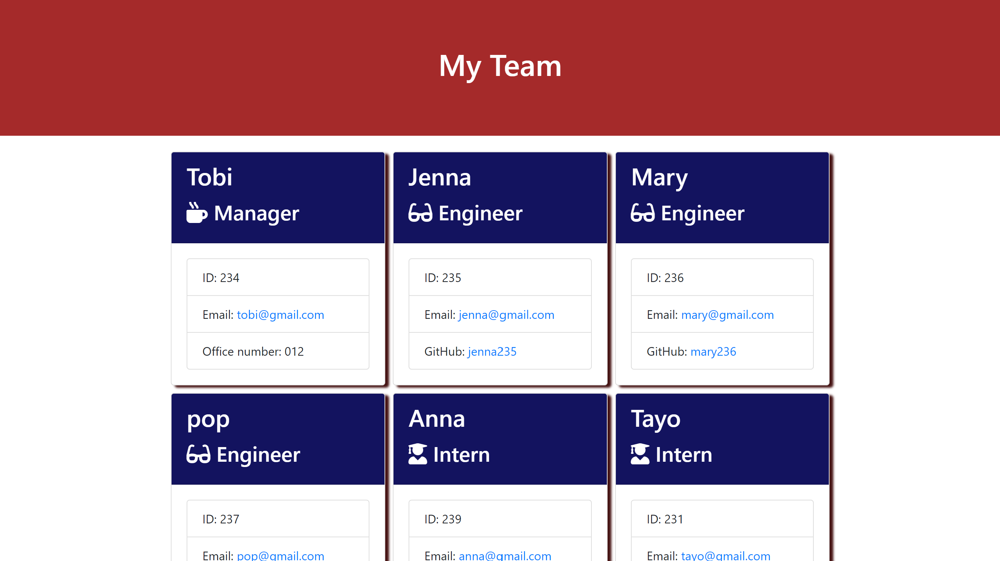

# Team Profile Generator
  
## Description 
  
A Node.js command-line application that collects information about employees on a software team, then genrates an HTML webpage that displays each employee's profile.

### User Story
> As a manager it’s important to have stay connected with my team 
>
>  I want a profile generator that can generate a webpage that displays my team's basic info
>
>  So that any user will have quick access to team member's emails and GitHub profiles.

### Acceptance Criteria
>1. The team profile generator app is ran in the command-line and accepts user input.
>
> 2. The user is prompted to provide information about the manager and additional employees [i.e., engineers and/or interns]. The app also ensures that the user's input is in the proper format
>
> 3. The code uses inquirer to gather information about the development team members and creates objects for each team member.
>
> 4. When a user starts the application then they are prompted to enter the **team manager**’s:
>> * Name
>> * Employee ID
>> * Email address
>> * Office number
>
> 5. When a user enters those requirements then the user is presented with a menu with the option to:
>> * Add an engineer
>> * Add an intern 
>> * Finish building the team
> 
> 6. If selects the **intern** option then the user is prompted to enter the following and then the user is taken back to the menu:
>> * Intern’s name
>> * ID
>> * Email
>> * School
> 
> 7. If selects the **engineer** option then the user is prompted to enter the following and then the user is taken back to the menu:
>> * Engineer's Name
>> * ID
>> * Email
>> * GitHub username
> 
> 6. When a user decides to **Finish building team** then they exit the application, and the HTML is generated. 

---
## Table of Contents

* [Description](#description)
* [Installation](#installation)
* [Usage](#usage)
* [License](#license)
* [Contributors](#contributors)
* [Tests](#tests)
* [Credits](#credits)
* [Questions](#questions)

---
## Installation

- Clone repo

        git clone https://github.com/Thorbieey/Profile-Generator.git
        

- Initialize npm and install dependencies

- Run **index.mjs** in command line

        node index.mjs

---
## Usage 

### Repository

* The URL of the GitHub repository: 
[https://github.com/Thorbieey/Profile-Generator.git](https://github.com/Thorbieey/Profile-Generator.git)

### Screenshots

---
## License

This application is covered under: **The MIT License**. Learn more about [choosing licenses](https://choosealicense.com/licenses/).

---
## Contributors

When contributing to this repository, please first discuss the change you wish to make via email, issue, linkedIn or any other method with the owner of this repository before making a change. 

### Pull Request Process

1. Fork the repository

2. Create a feature branch.

        git checkout -b name/feature/new-feature

3. Add and commit your changes.

        git add .
        git commit -m "short description of feature"

4. Push your contribution to the created branch.

        git push

5. Submit a new Pull Request on GitHub.

---
## Tests

- Run jest in commant line.

        npm run test

---
## Credits

- [Learn about path.js](https://nodejs.org/api/path.html#pathjoinpaths)

- [Explore npm's: **inquirer**](https://www.npmjs.com/package/inquirer)

- [Learn about the new operator](https://developer.mozilla.org/en-US/docs/Web/JavaScript/Reference/Operators/newo)

---
## Questions

Got any additional questions/enquiries? Reach out to **Tobi Olajide** via:

Email: tobiolajide223@gmail.com

GitHub: [Thorbieey](https://github.com/Thorbieey)

LinkedIn: https://www.linkedin.com/in/tobi-olajide/

  
---